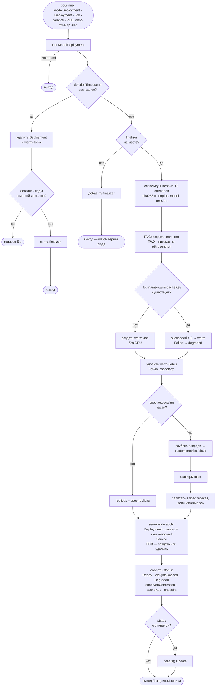
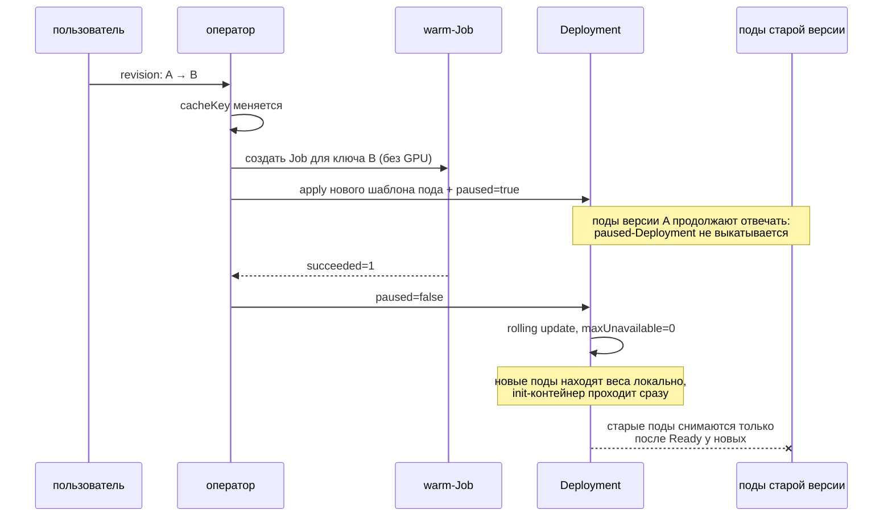

# k8s-model-operator

Оператор Kubernetes, который разворачивает LLM-инференс так, чтобы холодный старт
на десятки гигабайт весов не ломал ни выкатку новой версии модели, ни автоскейлинг:
веса скачиваются один раз в общий том, выкатка ждёт прогретый кэш, а число реплик
считается по глубине очереди запросов, а не по CPU.

---

## Задача

Снаружи инференс-сервер выглядит как обычный HTTP-сервис: Deployment, Service,
проба на `/health`, HPA сверху. Внутри у него три свойства, из-за которых этот
набор не работает.

**Под поднимается минутами, а не секундами.** Веса модели на 7B — это ~15 ГБ,
на 70B — 130–140 ГБ. Пока их нет на узле, под их качает; когда они есть, их ещё
надо загрузить в память GPU. Вся механика Kubernetes вокруг Deployment
предполагает, что замена пода стоит секунды: `maxUnavailable`, дефолтный
`livenessProbe`, реакция HPA на всплеск. На минутах это перестаёт быть верным —
не «медленнее», а именно неверно.

**CPU ничего не говорит о загрузке.** Во время генерации процесс ждёт GPU.
Утилизация CPU у пода с одним активным запросом и у пода с сорока запросами в
очереди отличается на единицы процентов. HPA на CPU в этом сценарии либо не
срабатывает никогда, либо срабатывает на шуме токенизатора.

**Смена версии модели — это не rolling update.** Поменяли `revision` — и каждый
новый под начинает качать веса заново. С `maxUnavailable: 25%` сервис при этом
теряет четверть мощности на всё время скачивания, а `livenessProbe` со
стандартным `failureThreshold` успевает убить под до того, как тот загрузится.

Этот репозиторий — контроллер, который эти три вещи разруливает явно:
предзагрузка весов отдельной Job в общий том, выкатка на паузе до тех пор, пока
кэш не прогрет, и автоскейлинг по сигналу, который действительно отражает
нехватку мощности.

---

## Архитектура

Один CRD — `ModelDeployment` в группе `serving.lpogosu.dev/v1alpha1`. Контроллер
разворачивает его в Deployment, Service, PVC под кэш весов, PodDisruptionBudget и
Job, которая веса скачивает.



Смена модели по времени выглядит так — и это главный сценарий, ради которого
оператор существует:



---

## Решения и компромиссы

### Оператор, а не Helm-чарт с HPA

Чарт разворачивается один раз и после этого ничего не наблюдает. Три вещи из-за
этого сделать нечем.

**Порядок.** При смене `revision` нужно сначала скачать веса, а выкатывать —
потом. Чарт рендерит Job и Deployment одновременно и не может поставить между
ними зависимость «дождись, пока Job завершится успешно». Хуки Helm умеют «до
установки» и «после установки», но не «после того, как этот конкретный Job
завершился, снять паузу с этого конкретного Deployment» — потому что к этому
моменту `helm upgrade` уже вернул управление.

**Статус.** У чарта нет места, куда записать «веса качаются, осталось столько-то»
или «Job упала, потому что такой ревизии нет». Всё это выясняется чтением логов
подов. У `ModelDeployment` для этого есть `WeightsCached`, `Degraded` и
`observedGeneration` — то есть на них можно повесить алерт и на них можно
дождаться в CI.

**HPA не знает про кэш.** HorizontalPodAutoscaler масштабирует по метрике и не
имеет способа узнать, что новая реплика сейчас встанет в Init на десять минут и
всё это время будет держать GPU. Оператор это знает и просто не поднимает реплики,
пока `WeightsCached` ложно.

Чем чарт лучше: не нужен ни CRD, ни контроллер в кластере, ни ещё один ServiceAccount
с правами на Deployment во всех неймспейсах. Если модель фиксированная и меняется
раз в квартал, чарт с HPA — правильный ответ, и добавлять сюда оператор незачем.
Оператор окупается ровно там, где модели меняются часто и весят много.

Отдельно про KEDA: масштабирование по внешней метрике она закрывает лучше и
дешевле, чем этот код (`ScaledObject` — это десять строк). Но KEDA тоже не умеет
секвенсить смену модели, так что она заменяет здесь автоскейлинг, а не оператор.

### CRD, а не аннотации на Deployment

Дешёвая альтернатива — контроллер, который смотрит на все Deployment в кластере и
реагирует на аннотацию вида `serving.lpogosu.dev/model: Qwen/...`. Отвергнута по
четырём причинам, из которых третья решающая.

1. **Нет схемы.** Опечатка в имени аннотации — это молчаливое ничего.
   У CRD валидация выполняется API-сервером: `engine` — enum из двух значений,
   `port` — 1..65535, а правило CEL `has(self.size) || has(self.existingClaimName)`
   не даёт создать кэш без указанного размера. Это проверено тестом, который
   создаёт заведомо неверный объект и ждёт `Invalid`.
2. **Нет места под статус.** Писать статус обратно в аннотации того же объекта —
   значит конфликтовать с тем, кто этот объект применяет из git.
3. **Конфликт владения.** Оператору нужно управлять `spec.replicas` и целиком
   `spec.template` того самого Deployment, который пишет пользователь. Каждый
   `kubectl apply` и каждая синхронизация Argo CD откатывали бы решения оператора.
   С отдельным CRD Deployment принадлежит оператору целиком, а пользователь
   владеет другим объектом — и границы не пересекаются.
4. **Права.** Аннотации означают watch на все Deployment кластера. CRD — watch на
   свой ресурс.

Цена: CRD ставится кластерно и требует прав кластерного администратора один раз,
а `kubectl get deploy` перестаёт показывать всю правду — надо смотреть
`kubectl get modeldeployment`.

### Сигнал автоскейлинга: глубина очереди

Три кандидата, и два из них выглядят разумно ровно до первого замера.

| Сигнал | Что на самом деле измеряет | Почему не подходит |
|---|---|---|
| CPU | ожидание GPU | почти константа: разница между «один запрос» и «сорок в очереди» — единицы процентов |
| GPU utilization (`DCGM_FI_DEV_GPU_UTIL`) | долю времени, когда на GPU выполнялось хоть какое-то ядро | один активный запрос уже держит её у 100 %; метрика насыщается задолго до того, как насытится сервис |
| глубина очереди (`vllm:num_requests_waiting`) | запросы, принятые сервером и ещё не начавшие генерацию | — |

Глубина очереди — единственный из трёх, который линеен по «сколько ещё мощности
нужно»: два ожидающих запроса и двадцать отличаются в десять раз, и именно во
столько же раз отличается недостающая мощность. Это же и метрика, которую видит
пользователь: очередь — это время до первого токена.

Честная цена решения названа прямо: это не ресурсная метрика, и её неоткуда взять.
Она приходит к оператору через `custom.metrics.k8s.io`, а этот API в кластере
никто не обслуживает по умолчанию — нужен prometheus-adapter (или эквивалент) с
правилом, превращающим гейдж vLLM в per-pod метрику. Пока адаптера нет, оператор
ставит `Degraded=True` с причиной `QueueMetricUnavailable` и держит текущее число
реплик. Молча не масштабироваться было бы хуже: это выглядит как «всё хорошо».

Второе ограничение: у Ollama аналогичного счётчика нет. Автоскейлинг с
`engine: ollama` работать не будет, и это не баг, а отсутствующий источник данных.

### Правила скейлинга отличаются от HPA в трёх местах

Формула та же, что у HPA: `desired = ceil(queue / target)`. Отличия — там, где
реплика стоит GPU и несколько минут, а не запуск контейнера.

- **Вниз — по одной реплике за раз.** Пустая очередь — это метрика ноль, и
  формула HPA отвечает «иди на минимум» одним шагом. Для stateless-сервиса это
  нормально. Здесь это выбрасывает мощность, на восстановление которой уйдут
  минуты, — поэтому шаг вниз равен единице, и он ещё и заперт длинным окном
  (по умолчанию 15 минут против 60 секунд на подъём).
- **Вверх — не больше `maxScaleUpStep` за раз.** Всплеск метрики не должен уметь
  забрать все GPU пула раньше, чем на него кто-нибудь посмотрит.
- **Вверх — не при холодном кэше.** Реплика, поднятая сейчас, — это реплика той
  версии модели, которую вы прямо сейчас заменяете.

Нарушение границ чинится немедленно и оба окна игнорирует: если пользователь
только что снизил `maxReplicas`, ждать пятнадцать минут — это не стабилизация, а
неподчинение. Отдельный тест гоняет решения до сходимости: при постоянной
очереди набор правил обязан прийти в точку и остановиться, а не колебаться.

### Кэш весов: RWX-том, а не образ и не init-контейнер на каждый под

Три рабочих способа доставить веса на узел. Выбран третий, и у него самая
неприятная цена из трёх.

| Способ | Что даёт | Чем платит |
|---|---|---|
| **Запечь в образ** | самый быстрый старт после первого пула на узле; никакого внешнего хранилища | образ на 40+ ГБ: каждый push и pull двигает его целиком; смена модели = пересборка и перезалив всего; image GC на узле может его вытеснить; новый узел = 40 ГБ перед первым подом; веса с ограничивающей лицензией оказываются в вашем реестре |
| **Init-контейнер качает на каждый под** | ничего не надо собирать и негде хранить | N реплик = N скачиваний: и время, и трафик; латентность scale-up равна времени скачивания; hub становится жёсткой зависимостью каждого подъёма реплики |
| **Общий RWX-том** (выбрано) | скачивание один раз, scale-up стоит только загрузки с диска в память GPU | нужен ReadWriteMany — NFS, CephFS, EFS, Filestore: ни один не бесплатный и ни один не быстрый; чтение теперь общее, и одновременный старт пяти подов тянет десятки гигабайт по сети; том — единая точка отказа; старые ревизии на нём никто не удаляет |

Последний пункт — не недосмотр, а сознательный отказ. Оператор не может знать,
не обслуживает ли другой `ModelDeployment`, подключённый к тому же
`existingClaimName`, ту ревизию, которую хочется удалить. Поэтому Job'ы прошлых
ключей удаляются, а каталоги с весами остаются, и место на томе — забота
владельца тома. Ровно по этой же причине PVC, указанный через
`existingClaimName`, никогда не получает owner reference и не удаляется вместе с
`ModelDeployment`.

Кэш при этом **выключен по умолчанию**: `spec.weightCache` — указатель, и `nil`
означает `emptyDir` на каждый под. Дефолт, требующий класса хранения, которого в
обычном кластере нет, — это дефолт, который падает при первой установке. Для
модели на 4 ГБ и для кластера без RWX per-pod-режим и есть правильный.

**Инвалидация.** Ключ кэша — `sha256(engine, model, revision)[:12]`. В него
намеренно не входит образ рантайма: апгрейд vLLM не меняет скачанные байты, и
привязка ключа к образу выбрасывала бы прогретый кэш на каждом бампе версии.
Движок входит: vLLM и Ollama раскладывают веса на диске по-разному.

Из этого следует ограничение, которое надо назвать вслух: `revision: main` — это
дыра. Ветка может переехать на другой коммит, ключ кэша при этом не изменится, и
оператор продолжит считать кэш валидным. В примере в `config/samples` стоит
полный SHA коммита именно поэтому.

### Пауза вместо остановки

Механизм, который держит выкатку, — `spec.paused` на Deployment. Выбран потому,
что paused-Deployment **продолжает масштабировать** существующий ReplicaSet и
отказывается только выкатываться: старые поды живут и отвечают, новые не
создаются. Это ровно то поведение, которое нужно на время скачивания.

Альтернативы и почему они хуже:

- `replicas: 0` до прогрева — это просто отказ в обслуживании на время скачивания.
- Только init-контейнер, ждущий маркер. Под, запросивший `nvidia.com/gpu`,
  занимает устройство с момента планирования, включая всю фазу Init. Блокировка в
  init означает GPU, простаивающий десять минут. Init-контейнер в шаблоне остался,
  но как вторая линия обороны — против запаздывания видимости файла на RWX-томе,
  когда Job записала маркер на одном узле, а под стартует на другом. И он
  **завершается с ошибкой** по истечении `loadTimeoutSeconds`, а не висит вечно:
  под в `Init` заметить труднее, чем под в `CrashLoopBackOff`.

Маркер — файл `<mountPath>/.warm/<cacheKey>`, который Job пишет **последним**,
после успешного скачивания. Проверять сами веса оператор не пытается: пересчёт
хеша шестидесяти гигабайт на каждом старте пода стоит дороже, чем скачивание,
которое он экономит.

### Пробы: без startupProbe всё остальное бессмысленно

`livenessProbe` со стандартными настройками убивает под примерно через 30 секунд —
то есть всегда, пока модель грузится. Поэтому у серверного контейнера есть
`startupProbe` с бюджетом `loadTimeoutSeconds`, и liveness с readiness начинают
работать только после того, как он прошёл. Тест на рендере проверяет
арифметику: `failureThreshold × periodSeconds` не может быть меньше
`loadTimeoutSeconds`.

Трафик на грузящийся под не попадает без всякого участия оператора: в Endpoints
входят только Ready-поды. Это стоит сказать явно, потому что соблазн написать
собственную маршрутизацию здесь большой, а нужен всего лишь честный
`readinessProbe` — у vLLM `/health` отвечает только после инициализации движка.
У Ollama такого эндпоинта нет, вместо него `/api/tags`, который отвечает сразу
после подъёма сервера, — readiness на Ollama слабее, и это тоже названо в коде.

Ещё одна мелочь с большими последствиями: при включённом кэше в контейнер
проставляется `HF_HUB_OFFLINE=1`. Это превращает «прогретый под всё равно
стартует десять минут, потому что тихо докачивает недостающий файл» в немедленную
видимую ошибку.

### Server-side apply, а не read-modify-write

Дочерние объекты применяются через SSA с field manager `k8s-model-operator`.
API-сервер знает, какие поля принадлежат оператору: дрейф в них откатывается,
а поля, выставленные дефолтингом или другим контроллером, не трогаются. Без этого
пришлось бы диффать отрендеренный `PodSpec` с сохранённым, а сохранённый
отличается на два десятка полей, которые дописал сам API-сервер.

Побочный и важный эффект: повторный apply без изменений не поднимает
`resourceVersion`. Это то, что делает второй проход реконсиляции настоящим
no-op — без выкатки, без смены generation, без событий у наблюдателей. Проверяется
не на словах: тест фиксирует `resourceVersion` всех дочерних объектов, гоняет
реконсиляцию ещё дважды и сравнивает.

Цена: типизированные структуры Go всегда сериализуют `creationTimestamp: null` и
пустой `status`. Оба поля вырезаются перед apply — иначе field manager объявит
своим `status` Deployment'а и начнёт перетягивать его у контроллера Deployment.

Два объекта через SSA **не** идут:

- **PVC** — почти все его поля неизменяемы после создания. Создаётся один раз,
  дальше не трогается; изменение `size` в спеке не доезжает до тома, и расширение
  остаётся явной операцией над claim. Молча пытаться расширить том на каждой
  реконсиляции — значит превратить опечатку в бесконечный цикл падающих apply.
- **warm-Job** — шаблон пода у Job неизменяем. Сходиться там нечему: изменение
  спеки меняет ключ кэша, а значит и имя Job.

### Число реплик живёт в одном месте

При включённом автоскейлинге оператор пишет своё решение обратно в
`spec.replicas` — так же, как HPA пишет в Deployment. Альтернатива (пользовательское
значение в спеке, решение оператора в статусе) означает, что `kubectl get`
показывает число, которого никто не придерживается, а scale-subresource врёт.

Цена названа прямо и не решена: под GitOps `spec.replicas` будет показываться как
дрейф при каждом масштабировании. Лечится тем же, чем лечат это у HPA —
`ignoreDifferences` на этот путь, — и остаётся неприятностью, а не решённой
проблемой.

### PodDisruptionBudget только тогда, когда он выполним

`minAvailable: 1` перед одной репликой не защищает доступность — он навсегда
блокирует `kubectl drain` на узле с этим подом. Поэтому бюджет создаётся только
при двух и более репликах, а запрошенное значение ограничивается сверху
`replicas - 1`; при уменьшении до одной реплики существующий бюджет удаляется.

---

## Что оператор намеренно не делает

Каждый пункт — это то, что просят добавить первым, и то, чего здесь не будет.

- **Мультитенантность и квоты по командам.** Требует модели идентичности и
  admission-слоя. Неймспейсы плюс `ResourceQuota` закрывают 90 % задачи
  средствами самого Kubernetes, а оставшиеся 10 %, сделанные наполовину, хуже
  отсутствия.
- **Реестр моделей.** Оператор принимает ссылку и ревизию. Решать, какие модели
  вообще существуют и кто их одобрил, — вопрос организации, и живёт он слоем выше.
- **Учёт стоимости.** Нужны цены, которых у кластера нет. kube-state-metrics плюс
  OpenCost делают это лучше, и метки, которые оператор уже расставляет
  (`app.kubernetes.io/instance`, `serving.lpogosu.dev/model-deployment`), для этого
  достаточны.
- **Маршрутизация запросов, несколько моделей на одном GPU, горячая подмена
  LoRA.** Это задача роутера, а не контроллера. Контроллер, который начинает
  разбирать HTTP, перестаёт быть контроллером.
- **Канареечные выкатки по версии модели.** Требуют разделения трафика, то есть
  mesh или Gateway API. Оператор может подготовить два `ModelDeployment`;
  разделять между ними трафик должен тот, кто этим трафиком и так управляет.
- **Уборка старых весов с тома.** Обосновано выше: нет способа узнать, кто ещё их
  читает.

---

## Что проверено

Тесты контроллера идут против **настоящего API-сервера** (`envtest`: `kube-apiserver`
и `etcd`, поднятые в процессе теста), а не против fake-клиента. Это принципиально:
дефолтинг CRD, правила CEL, subresource `status`, owner references и server-side
apply — ровно те части, которых у fake-клиента нет, и ровно те, на которых
построен этот контроллер.

| Тест | Что утверждает |
|---|---|
| `TestReconcileCreatesChildrenAndHoldsTheRollout` | из CR получаются PVC (RWX, 200Gi), warm-Job без GPU, Deployment с `paused=true`, init-контейнером, startupProbe и `maxUnavailable=0`, Service, PDB; условия — `Warming` / `WaitingForWeights` / не `Degraded` |
| `TestWarmCacheReleasesTheRolloutAndReportsReady` | `succeeded=1` у Job снимает паузу; `WeightsCached=True`; после появления Ready-реплик `Ready=True` и `status.replicas` совпадает |
| `TestReconcileIsIdempotent` | после сходимости две лишние реконсиляции не меняют `resourceVersion` ни у одного объекта, включая сам CR |
| `TestModelChangeRotatesTheCacheAndHoldsTheOldPods` | смена `revision` меняет ключ, создаёт новую Job, удаляет старую, снова ставит выкатку на паузу и обновляет аннотацию шаблона пода |
| `TestWarmJobFailureIsReportedAsDegraded` | упавшая Job → `Degraded=True` с текстом причины, пауза не снимается |
| `TestSingleReplicaGetsNoDisruptionBudget` | при уменьшении до одной реплики PDB удаляется |
| `TestDeletionWaitsForPodsBeforeReleasingTheCache` | Deployment и Job'ы удаляются первыми, finalizer держится, пока жив хоть один под, и снимается после |
| `TestAutoscalingScalesOnQueueDepth` | очередь 20 при цели 4 и шаге 2 даёт 1 → 3, а не 1 → 5; `lastScaleTime` записан; повторный проход через секунду ничего не меняет |
| `TestAutoscalingWithoutAMetricsAdapterIsDegraded` | недоступная метрика → `Degraded=True/QueueMetricUnavailable`, реплики не тронуты |
| `TestWithoutAWeightCacheThereIsNoJobAndNoPause` | без `weightCache` нет ни PVC, ни Job, ни init-контейнера, ни паузы; том — `emptyDir` |
| `TestCRDDefaults` | восемь дефолтов CRD зафиксированы значениями, которые предполагает код рендера |
| `TestWeightCacheRequiresSizeOrClaim` | правило CEL действительно отклоняет объект |
| `TestSamplesApplyCleanly` | файлы из `config/samples` разбираются строго и принимаются API-сервером |

Чистая логика покрыта табличными тестами без кластера: `internal/scaling` — 16
случаев на границы, окна стабилизации, шаг вниз и немедленное подчинение
изменённым границам, плюс проверка сходимости; `internal/render` — устойчивость и
чувствительность ключа кэша, ограничение PDB, аргументы обоих движков, порядок
«скачать, потом записать маркер», арифметика startupProbe.

Реальный прогон:

```
$ make verify
go fmt ./...
go vet ./...
bin/golangci-lint run ./...
0 issues.
bin/controller-gen crd rbac:roleName=model-operator paths=./api/v1alpha1 paths=./internal/controller ...
bin/controller-gen object paths=./api/v1alpha1 paths=./internal/controller
KUBEBUILDER_ASSETS="$(bin/setup-envtest use 1.34.1 --bin-dir bin/envtest -p path)" go test ./... -race -count=1
?   	github.com/lpogosu/k8s-model-operator/api/v1alpha1	[no test files]
?   	github.com/lpogosu/k8s-model-operator/cmd	[no test files]
ok  	github.com/lpogosu/k8s-model-operator/internal/controller	11.207s
?   	github.com/lpogosu/k8s-model-operator/internal/queue	[no test files]
ok  	github.com/lpogosu/k8s-model-operator/internal/render	1.022s
ok  	github.com/lpogosu/k8s-model-operator/internal/scaling	1.015s
```

### Чего в этих числах нет

Здесь нет ни одного бенчмарка производительности инференса, и это не упущение:
кластера с GPU у репозитория нет, ни один токен этим кодом не сгенерирован.
Утверждения о времени старта и о размере весов — это свойства моделей и рантаймов,
а не измерения этого оператора.

`envtest` поднимает API-сервер и etcd, но не kube-controller-manager и не kubelet.
Поэтому всё, что происходит **внутри** пода, проверено на отрендеренной спецификации,
а не наблюдением: init-контейнер действительно ждёт нужный файл — но что он
дождётся, тестами не показано. То же про пробы, про `paused` (проверено, что поле
выставлено; что Deployment-контроллер поведёт себя как описано — известно из его
поведения, а не из этого прогона) и про монтирование RWX-тома.

Манифест деплоя (`config/default`) рендерится в CI, но на живой кластер не
применялся.

---

## Запуск

Нужен Go 1.27 и `make`. Всё остальное — генератор кода, линтер, `kube-apiserver` и
`etcd` для тестов — скачивается в `./bin` первым же запуском.

```sh
git clone https://github.com/lpogosu/k8s-model-operator.git
cd k8s-model-operator
make verify
```

`make verify` — это `fmt`, `vet`, `lint` и весь набор тестов, включая envtest.
Кластер для этого не нужен: API-сервер поднимается локально.

Установка в настоящий кластер:

```sh
make install                 # только CRD
make deploy IMG=<образ>      # CRD + RBAC + менеджер в namespace model-operator-system
make sample                  # два примера ModelDeployment
```

`kubectl get modeldeployment` печатает модель, движок, `Ready`, `Cached`, число
реплик и возраст — колонки объявлены в CRD, чтобы состояние прогрева было видно
без `-o yaml`. Пока `Cached` ложно, выкатка стоит на паузе; подробности — в
условиях:

```sh
kubectl get modeldeployment qwen-7b -n inference -o jsonpath='{.status.conditions}' | jq
```

### Цели Makefile

| Цель | Что делает |
|---|---|
| `make verify` | `fmt` + `vet` + `lint` + `test` — то же, что гоняет CI |
| `make test` | envtest-набор и юнит-тесты, `-race`, с автоскачиванием бинарей API-сервера |
| `make manifests generate` | перегенерация CRD, RBAC и deepcopy из Go-типов и маркеров |
| `make check-generated` | падает, если сгенерированное разошлось с кодом |
| `make lint` | golangci-lint фиксированной версии |
| `make build` / `make run` | сборка бинаря / запуск против текущего kubecontext |
| `make docker-build` | образ оператора |
| `make install` / `make deploy` | CRD / CRD + RBAC + менеджер |
| `make clean` | удаляет `./bin` со всем скачанным инструментарием |

---

## API вкратце

Полная схема — в `config/crd/bases`, примеры — в `config/samples`.

| Поле | Смысл |
|---|---|
| `model.name`, `model.revision` | что грузить; ревизия входит в ключ кэша, поэтому её стоит пинить коммитом |
| `model.secretRef` | Secret с переменными окружения — например `HF_TOKEN` для закрытых моделей |
| `runtime.engine` | `vllm` или `ollama`: меняет образ, аргументы и путь health-эндпоинта |
| `runtime.resources` | обычные requests/limits, GPU — через `nvidia.com/gpu`, своего поля под GPU нет |
| `runtime.loadTimeoutSeconds` | бюджет startupProbe: сколько поду разрешено грузиться |
| `replicas` | единственное место, где живёт число реплик; при автоскейлинге его пишет оператор |
| `weightCache` | `nil` — кэша нет, каждый под качает сам; иначе RWX-том на `size` или готовый `existingClaimName` |
| `autoscaling` | `nil` — фиксированное число реплик; иначе границы, целевая глубина очереди, окна и шаг подъёма |
| `disruption.minAvailable` | верхняя граница бюджета; фактический обрезается по `replicas - 1` |

Статус: `Ready`, `WeightsCached`, `Degraded`, `observedGeneration`, `cacheKey`,
`replicas` / `readyReplicas`, `observedQueueDepth`, `lastScaleTime`, `endpoint`.

---

## Структура репозитория

```
.
├── api/v1alpha1/                 # типы ModelDeployment, маркеры, сгенерированный deepcopy
├── cmd/main.go                   # сборка менеджера, клиент custom-метрик, пробы
├── internal/
│   ├── controller/               # реконсиляция, статус, весовой кэш + envtest-тесты
│   ├── render/                   # чистые функции спека → объекты, ключ кэша, скрипты Job
│   ├── scaling/                  # решение о числе реплик, без клиента и без часов
│   └── queue/                    # чтение глубины очереди из custom.metrics.k8s.io
├── config/
│   ├── crd/bases/                # сгенерированная схема CRD
│   ├── rbac/                     # role.yaml генерируется из маркеров на реконсайлере
│   ├── manager/                  # Deployment менеджера, две реплики, leader election
│   ├── default/                  # kustomize-оверлей: namespace + CRD + RBAC + менеджер
│   └── samples/                  # два CR: vLLM с кэшем и автоскейлингом, Ollama без них
├── Dockerfile                    # многостадийная сборка на distroless/static:nonroot
├── Makefile
└── .github/workflows/ci.yml      # generated · lint · test · manifests · image
```

---

## Лицензия

MIT — см. [LICENSE](LICENSE).
